<!-- ========================= -->
<!--        HEADER             -->
<!-- ========================= -->

  

  

  Sinta-se à vontade para explorar meu perfil. 
  Aqui compartilho meus estudos, tecnologias, experiências e projetos na área de desenvolvimento.

---

<!-- ========================= -->
<!--        SOBRE MIM          -->
<!-- ========================= -->

<h2 align="center">👨‍💻 Sobre Mim</h2>

  Olá! Meu nome é <strong>Gabriel</strong> e sou estudante de
  <strong>Análise e Desenvolvimento de Sistemas</strong> na Cruzeiro do Sul.

  Meu objetivo é construir uma carreira sólida na área de tecnologia,
  combinando <strong>Desenvolvimento de Software</strong>,
  <strong>Cloud Computing</strong>,
  <strong>DevOps</strong> e
  <strong>Inteligência Artificial</strong>.

  Atualmente, meu principal foco de estudo é <strong>Python</strong>,
  acompanhado por conhecimentos em <strong>HTML5</strong>,
  <strong>CSS3</strong> e <strong>JavaScript</strong>.

  Também venho aprofundando meus conhecimentos no ecossistema
  <strong>Microsoft Azure</strong>, explorando infraestrutura em nuvem,
  serviços Microsoft e soluções baseadas em Inteligência Artificial.

  Em meus estudos, laboratórios e projetos, utilizo ferramentas como
  <strong>Microsoft Foundry</strong>,
  <strong>Microsoft Copilot Studio</strong>,
  <strong>ChatGPT</strong>,
  <strong>Codex</strong>,
  <strong>GitHub Copilot</strong> e
  <strong>Lovable</strong>.

  Minha meta profissional é atuar como
  <strong>Desenvolvedor Full-Stack</strong>,
  integrando desenvolvimento de aplicações, Cloud e práticas de DevOps.

  Sou movido pela curiosidade e pelo aprendizado contínuo, buscando entender
  não apenas como utilizar uma tecnologia, mas também como ela funciona e
  como pode ser aplicada para resolver problemas reais.

---

<!-- ========================= -->
<!--        LINGUAGENS         -->
<!-- ========================= -->

<h2 align="center">💻 Linguagens & Desenvolvimento</h2>

  &nbsp;&nbsp;&nbsp;&nbsp;
  &nbsp;&nbsp;&nbsp;&nbsp;
  &nbsp;&nbsp;&nbsp;&nbsp;
  

  Python • HTML5 • CSS3 • JavaScript

---

<!-- ========================= -->
<!--        CLOUD / DEVOPS     -->
<!-- ========================= -->

<h2 align="center">☁️ Cloud & DevOps</h2>

  &nbsp;&nbsp;&nbsp;&nbsp;
  &nbsp;&nbsp;&nbsp;&nbsp;
  &nbsp;&nbsp;&nbsp;&nbsp;
  

  Microsoft Azure • Git • GitHub • Linux

---

<!-- ========================= -->
<!--        FERRAMENTAS        -->
<!-- ========================= -->

<h2 align="center">🛠️ Tecnologias & Ferramentas</h2>

  &nbsp;&nbsp;&nbsp;&nbsp;
  &nbsp;&nbsp;&nbsp;&nbsp;
  &nbsp;&nbsp;&nbsp;&nbsp;
  

  Visual Studio Code • Figma • Adobe Illustrator • Supabase

---

<!-- ========================================= -->
<!--        INTELIGÊNCIA ARTIFICIAL            -->
<!-- ========================================= -->

<h2 align="center">🤖 Inteligência Artificial & Desenvolvimento Assistido</h2>

  &nbsp;&nbsp;&nbsp;&nbsp;
  &nbsp;&nbsp;&nbsp;&nbsp;
  &nbsp;&nbsp;&nbsp;&nbsp;
  &nbsp;&nbsp;&nbsp;&nbsp;
  &nbsp;&nbsp;&nbsp;&nbsp;
  &nbsp;&nbsp;&nbsp;&nbsp;
  

  
    Microsoft Foundry &nbsp;•&nbsp;
    Copilot Studio &nbsp;•&nbsp;
    ChatGPT &nbsp;•&nbsp;
    Codex &nbsp;•&nbsp;
    Claude Code &nbsp;•&nbsp;
    GitHub Copilot &nbsp;•&nbsp;
    Lovable
  

 

  
  
  
  
  
  
  

---
---

<!-- ========================================= -->
<!--              PROJETOS                     -->
<!-- ========================================= -->

<h2 align="center">🚀 Projetos em Destaque</h2>

  <i>Espaço reservado para os meus principais projetos.</i>

 

<!--

===========================================================
MODELO PARA ADICIONAR PROJETOS FUTURAMENTE
===========================================================

Quando quiser adicionar seus projetos, remova o comentário
deste bloco e altere os dados abaixo.

Você pode colocar dois projetos por linha.

<table>
  <tr>

    <td width="50%" valign="top">

      <h3 align="center">🚀 Nome do Projeto</h3>

      

        
      

      

        Pequena descrição explicando o objetivo do projeto,
        o problema resolvido e as principais funcionalidades.
      

      

        <strong>Tecnologias:</strong> 
        Python • React • Supabase • Azure
      

      

        <a href="LINK_DO_REPOSITORIO">
          🔗 Repositório
        </a>
        &nbsp;•&nbsp;
        <a href="LINK_DA_DEMO">
          🌐 Demo
        </a>
      

    </td>

    <td width="50%" valign="top">

      <h3 align="center">💻 Nome do Projeto</h3>

      

        
      

      

        Pequena descrição explicando o objetivo do projeto,
        o problema resolvido e as principais funcionalidades.
      

      

        <strong>Tecnologias:</strong> 
        Python • JavaScript • Azure • IA
      

      

        <a href="LINK_DO_REPOSITORIO">
          🔗 Repositório
        </a>
        &nbsp;•&nbsp;
        <a href="LINK_DA_DEMO">
          🌐 Demo
        </a>
      

    </td>

  </tr>
</table>

-->

---

<!-- ========================= -->
<!--        CONTATOS           -->
<!-- ========================= -->

<h2 align="center">📫 Redes Sociais & Contatos</h2>

  
  &nbsp;&nbsp;

  
  &nbsp;&nbsp;

  
  &nbsp;&nbsp;

  
  &nbsp;&nbsp;

  
  &nbsp;&nbsp;

  

 

<!-- ========================= -->
<!--        FOOTER             -->
<!-- ========================= -->

  

